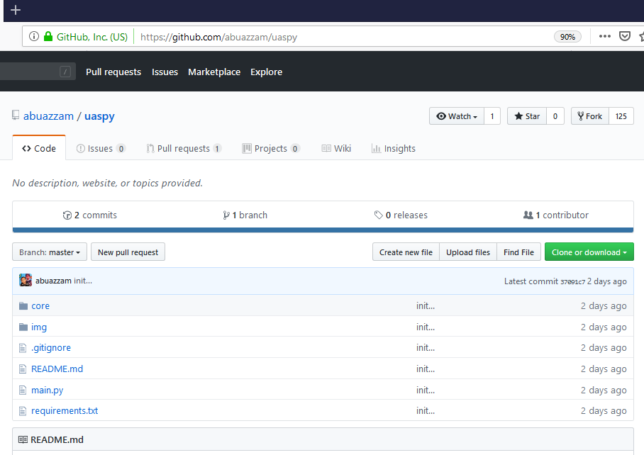
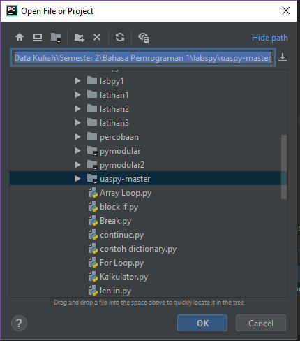

# UAS Bahasa Pemrograman 1

## Melakukan Fork Repository

* Masukkan alamat repository yang akan di fork pada Web Browser https://github.com/abuazzam/uaspy
* Klik pada pilihan Fork

![GitHub Logo] (Fork.PNG)

## Melakukan Clone ke Local Repository

* Klik pada pilihan Clone

![GitHub Logo] (clonelocal.PNG)

## Melakukan Konfigurasi Virtual Environment

* Buka Aplikasi PyCharm
* Klik File, Kemudian Pilih Open
* Lalu Pilih Folder Repository yang sudah di download tadi

## Menginstal Package Repository yang dibutuhkan

* Klik pada File
* Pilih Setting
* Klik pada bagian Interpreter maka muncul package yang diperlukan
![GitHub Logo] (packagelist.PNG)
* Klik tanda +
* Input package yang akan di install, lalu klik install pada package yang dipilih
![GitHub Logo] (installpackage.PNG)

